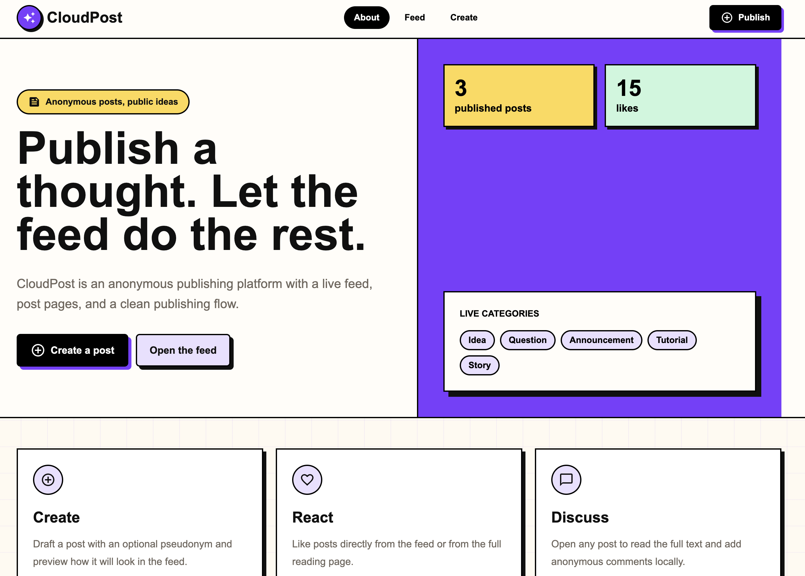
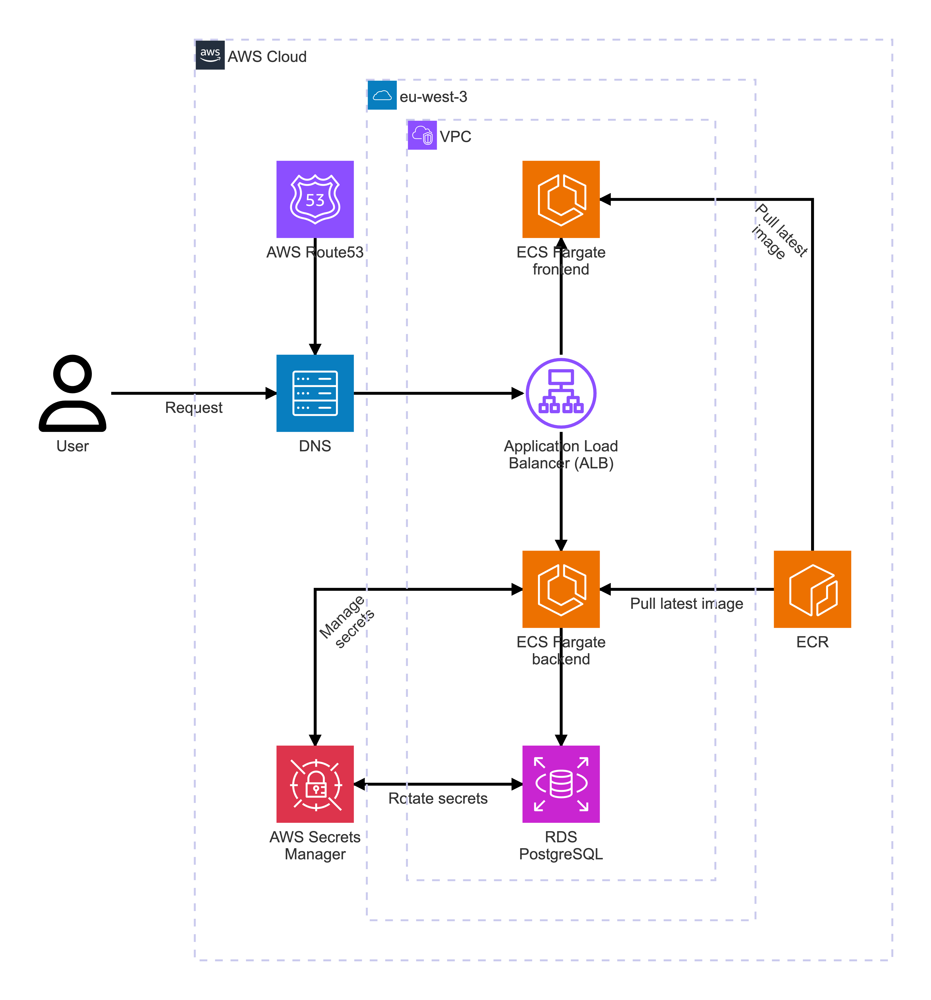
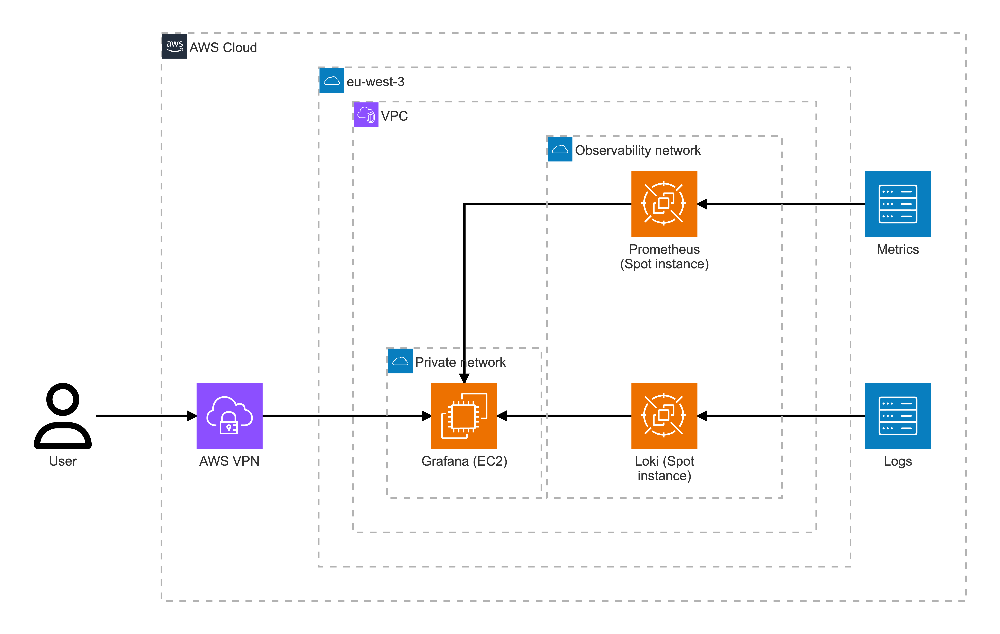
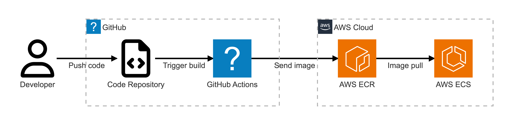

# Cloud Post

Cloud Post is a production-ready sample web application designed to demonstrate how to build a simple microservices architecture on AWS. It includes infrastructure as code for the main application, an observability stack, and a CI/CD pipeline. It allows users to create and manage posts, with a simple frontend and backend architecture.



## Summary

- [Technologies used](#technologies-used)
- [Engineering choices](#engineering-choices)
- [TODO](#todo)
- [Architecture](#architecture)
- [Main application](#main-application)
- [Monitoring and Observability](#monitoring-and-observability)
- [CI/CD](#ci--cd)
- [Possible improvements](#possible-improvements)
- [Deployment](#deployment)

## Technologies used

- **frontend**: [Next.js](https://github.com/vercel/next.js/)
- **backend**: [Nest.js](https://github.com/nestjs/nest)
- **database**: [PostgreSQL](https://github.com/postgres/postgres)
- **infrastructure**: [Terraform](https://github.com/hashicorp/terraform)
- **observability**: [Grafana](https://github.com/grafana/grafana), [Prometheus](https://github.com/prometheus/prometheus), [Loki](https://github.com/grafana/loki)
- **CI/CD**: [GitHub Actions](https://github.com/features/actions) and [AWS ECR](https://aws.amazon.com/fr/ecr/)

## Engineering choices

This project is intentionally built with a few practical patterns that make it easier to maintain, debug, and scale.

### Backend

- **NestJS** for a structured architecture with dependency injection, built-in route decorators, and pipe-based validation.
- **DTOs + Zod** for body, query, and param validation, with Zod pipes to validate and format incoming data at the edge.
- **Prisma** as the ORM, with its built-in migration system to keep schema changes predictable and versioned.
- **/health** route for simple liveness checks and infrastructure monitoring.
- **Logger middleware** to make request debugging and tracing easier during development.
- **Swagger** decorators to generate interactive API documentation at **/swagger**, with **/swagger/yaml** and **/swagger/json** available in development mode.
- **robots.txt** route to discourage indexing and reduce unwanted bot traffic.
- **Environment validation** with **ConfigModule**, **class-validator**, and **class-transformer** to keep runtime configuration type-safe.

### Frontend

- **Next.js** for a scalable React framework that supports SSR, CSR, and fast iteration on the same codebase.
- **SSR with initial API fetches and caching** to improve first-load performance and reduce repeated requests.
- **Shared components** across the application to keep the UI consistent and avoid duplication.
- **Tailwind CSS** and **Turbopack** to speed up UI development and local feedback loops.
- **Axios** for centralized API communication logic and consistent request handling.

## TODO

> [!NOTE]
> This project is still a work in progress, and some features are not yet implemented.
- [x] Local development setup with Docker Compose
- [x] Nest JS Setup
- [x] Next JS Setup
- [x] Backend done
- [x] Frontend done
- [x] Add documentation to Nest JS
- [ ] Terraform code for AWS infrastructure setup
- [ ] CI/CD pipeline with GitHub Actions and AWS ECR
- [ ] Observability stack with Grafana, Prometheus and Loki

## AWS Architecture example

This microservice architecture is designed for a simple web application. It may be improved by adding more sophisticated features (see [Possible improvements](#possible-improvements) section) and by refering to the AWS documentation (see [AWS Reference Architecture Diagrams](https://aws.amazon.com/fr/architecture/reference-architecture-diagrams/)).

### Main application



### Monitoring and Observability

Self-hosted observability stack deployed on AWS, with Grafana for visualization, Prometheus for metrics collection, and Loki for log aggregation. The observability stack is deployed in a private network, with access restricted to developers through a secure VPN connection.
- A managed PostgreSQL database using Amazon RDS could be used to store the required data and AWS Secrets Manager to manage the credentials for the database.
- Kafka could also be used to handle high volumes of logs and metrics, but for simplicity, I would use Prometheus and Loki directly to scrape and collect data from the application.



### CI / CD

This is a simple CI/CD pipeline using GitHub Actions to build and push Docker images to AWS ECR, which are then used by ECS Fargate to pull the latest images and deploy the application. The pipeline is triggered on every push to the main branch, and includes stages for building, testing, and deploying the application.



## Possible improvements

As this is a simple sample application, some features have not been implemented. Here are some of the features that could be added to make this architecture more scalable and production-ready:

- **CloudFront & WAF**: Can be added to protect against common web exploits
- **API Gateway**: Can be added as a first entry point for better redirection, caching and security features. It can also be coupled with a S3 bucket to serve static assets
- **AWS CodeDeploy and CodeBuild**: For a more robust CI/CD pipeline at scale (green/blue, custom deployments stages), AWS CodeDeploy and CodeBuild can be used
- **Mailing**: Use a third-party service like Brevo, SendGrid or AWS SES
- **Multi-region Deployment**
- **AWS KMS** for RDS data encryption
- **CDN**: Can be added to serve static assets and improve performance for users around the world
- **SSL/TLS**: Can be added using AWS Certificate Manager, to be used over the internet and between services
- **Event queue**: For highly scalable applications, an event queue like Kafka can be added
- **Data Pipeline**: A data pipeline for analytics may be added to gather insights (see [medallion architecture](https://www.databricks.com/blog/what-is-medallion-architecture)).
- **Orchestration**: For complex applications, an orchestration tool can be added to manage workflows with dependencies between services
- **Kubernetes**: For better scalability and management of containerized applications, Kubernetes can be used instead of EC2 instances
- **Proper code pipeline**: The current CI/CD pipeline is very basic and should be improved for production use, with proper testing stages, staging environment, and manual approval before production deployment
- **Backup and Disaster Recovery**: Implement backup strategies, and a disaster recovery plan to ensure business continuity in case of failures.

## Deployment

### Local deployment

The application can be deployed locally using Docker Compose. This is useful for development and testing purposes, but not recommended for production use.

#### Configure environment variables

A `.env` needs to be created in the root of the project. First copy the `example.env` file.

```
cp example.env .env
```

Then fill in the required values depending on your local setup.

#### Start the application using Docker Compose

```bash
./local-setup.sh
```

### AWS setup

TODO

## Local development

Install dependencies
```bash
cd cloud-post-api && npm ci && cd ../cloud-post-front && npm ci && cd ..
```

Build images
```bash
docker compose build
```

Run database
```bash
docker compose up -d cloud-post-db
```

Apply database migrations (env should contain the database url var)
```bash
cd cloud-post-api
npx env-cmd -f ../.env npx prisma migrate dev
```

Start backend
```bash
cd cloud-post-api && npx prisma generate && npm run start:dev
```

Start frontend
```bash
cd cloud-post-front && npm run dev
```
