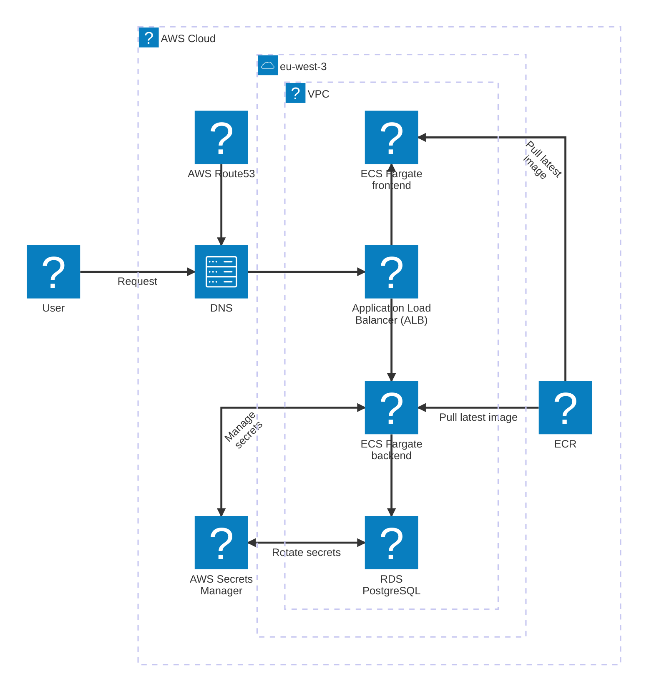

```mermaid
architecture-beta

service user(fa:user)[User]

group aws(aws:aws-cloud-logo)[AWS Cloud]

service dns(server)[DNS] in aws
service route53(aws:arch-amazon-route-53)[AWS Route53] in aws
group fr(cloud)["eu-west-3"] in aws

group vpc(aws:arch-amazon-virtual-private-cloud)["VPC"] in fr

service alb(aws:res-elastic-load-balancing-application-load-balancer)["Application Load Balancer (ALB)"] in vpc
service ecsfront(aws:arch-amazon-elastic-container-service)["ECS Fargate frontend"] in vpc
service ecsback(aws:arch-amazon-elastic-container-service)["ECS Fargate backend"] in vpc
service rds(aws:arch-amazon-rds)[RDS PostgreSQL] in vpc

service ecr(aws:arch-amazon-elastic-container-registry)["ECR"] in aws
service secretsmanager(aws:arch-aws-secrets-manager)[AWS Secrets Manager] in aws

user:R -[Request]-> L:dns
route53:B --> T:dns
dns:R --> L:alb

alb:T --> B:ecsfront

alb:B --> T:ecsback

ecsfront:R <-[Pull latest image]- T:ecr
ecsback:R <-[Pull latest image]- L:ecr

ecsback:B --> T:rds

ecsback:L <-[Manage secrets]-> T:secretsmanager
rds:L <-[Rotate secrets]-> R:secretsmanager
```