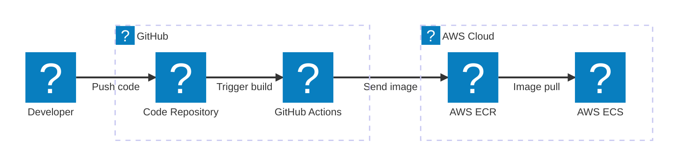

```mermaid
architecture-beta

service developer(fa:user)[Developer]

group github(logos:github-icon)[GitHub]

service actions(logos:github-actions)[GitHub Actions] in github

service code(fa:file-code)[Code Repository] in github

group aws(aws:aws-cloud-logo)[AWS Cloud]

service ecr(aws:arch-amazon-elastic-container-registry)[AWS ECR] in aws

service ecs(aws:arch-amazon-elastic-container-service)[AWS ECS] in aws

developer:R -[Push code]-> L:code
code:R -[Trigger build]-> L:actions
actions:R -[Send image]-> L:ecr
ecr:R -[Image pull]-> L:ecs
```