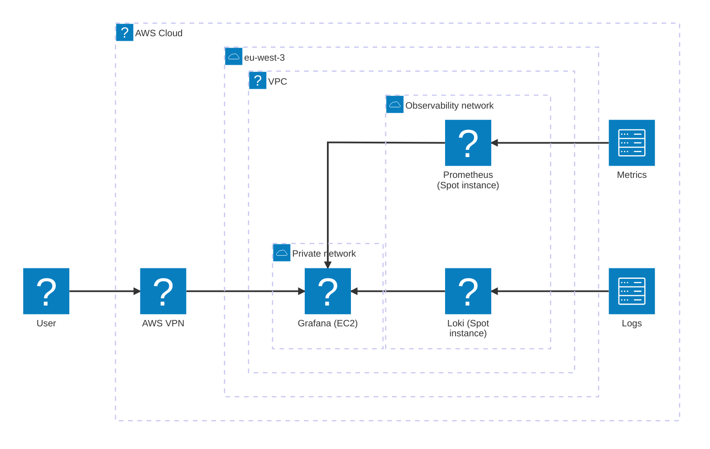

```mermaid
architecture-beta

service user(fa:user)[User]

group aws(aws:aws-cloud-logo)[AWS Cloud]

group fr(cloud)["eu-west-3"] in aws

group vpc(aws:arch-amazon-virtual-private-cloud)["VPC"] in fr

group privatecloud(cloud)["Private network"] in vpc
service vpn(aws:arch-aws-client-vpn)["AWS VPN"] in aws
service grafana(aws:arch-amazon-ec2)["Grafana (EC2)"] in privatecloud

group observability(cloud)["Observability network"] in vpc
service prometheus(aws:spot-fleet)["Prometheus (Spot instance)"] in observability
service loki(aws:spot-fleet)["Loki (Spot instance)"] in observability


service logs(server)[Logs] in aws
service metrics(server)[Metrics] in aws

user:R --> L:vpn
vpn:R --> L:grafana

grafana:T <-- L:prometheus
grafana:R <-- L:loki

prometheus:R <-- L:metrics
loki:R <-- L:logs
```